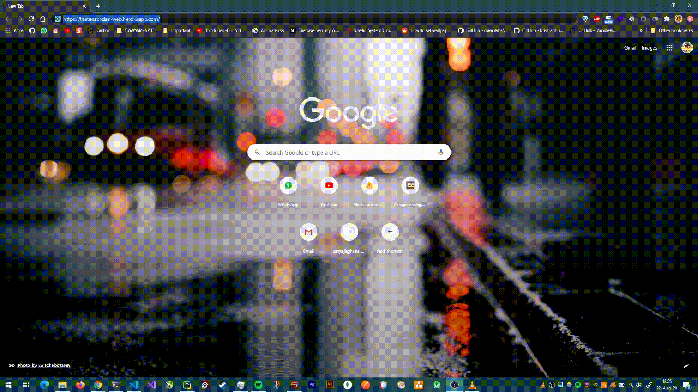
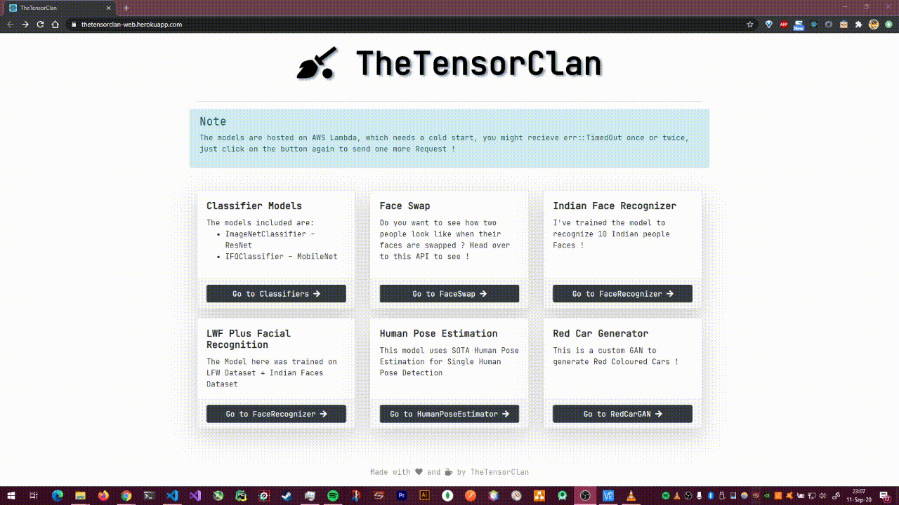
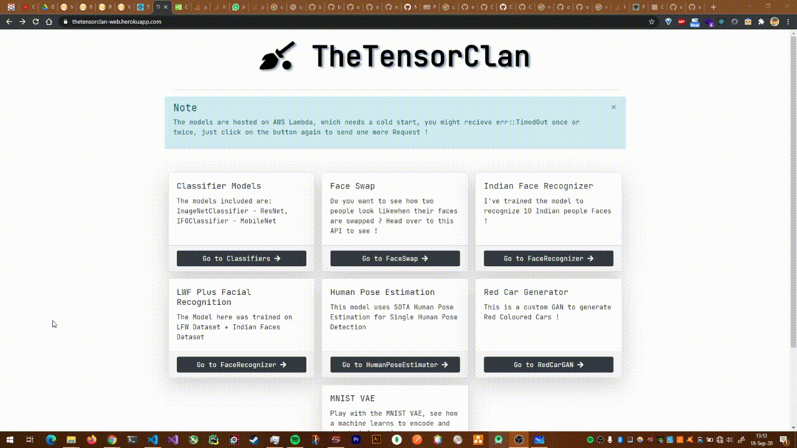
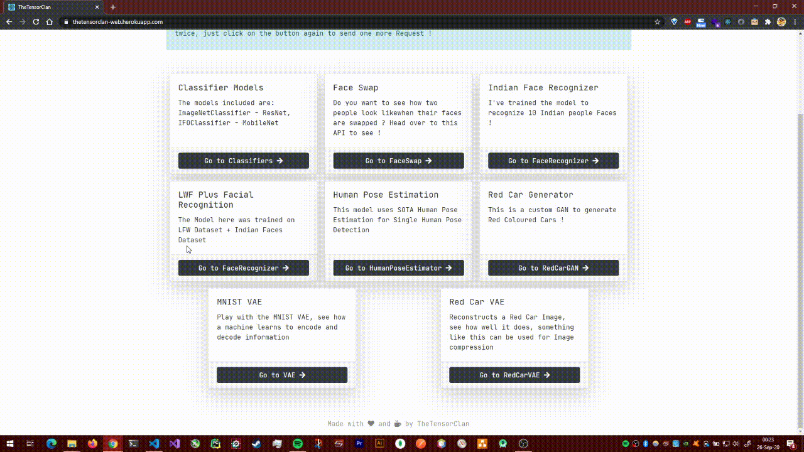
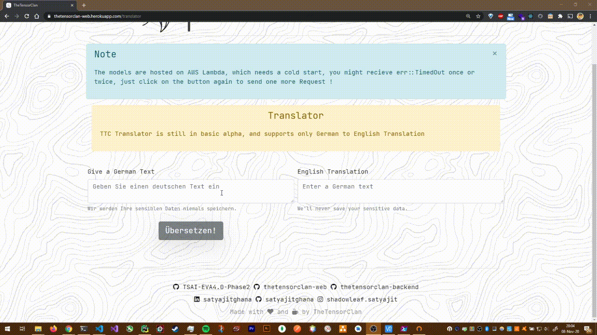
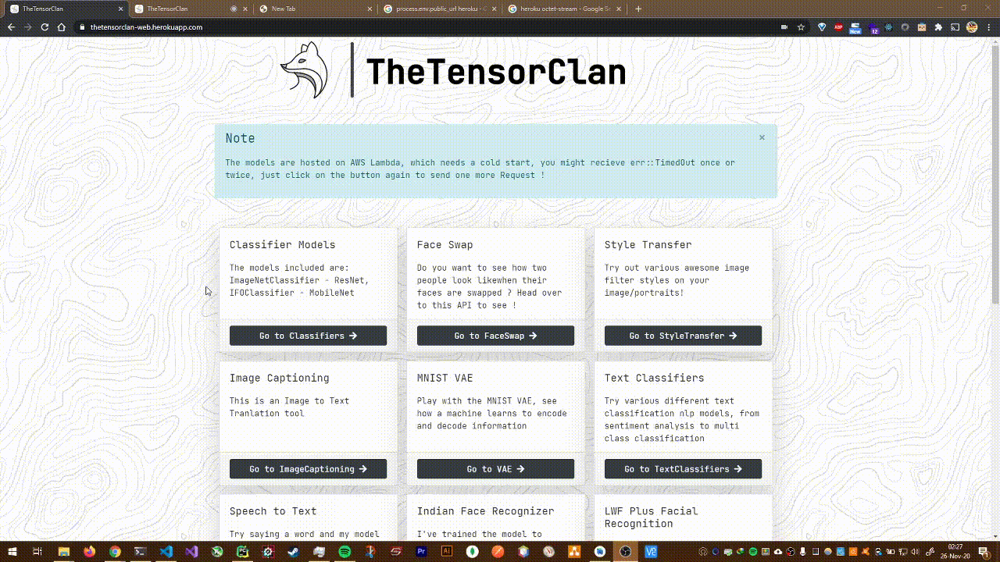

# TheTensorClan - Web

## Website: [https://thetensorclan-web.herokuapp.com/](https://thetensorclan-web.herokuapp.com/)

## 🎬 In Action

### Face Swap & Image Classifier


### Face Recognizer!



### LFW Face Recognizer


### Monocular Human Pose Estimator


### Red Car Generator



### MNIST VAE



### Red Car VAE



### IFO Super Resolution


### Text Classification


### Style Transfer


### German to English Translator



### Image Captioning


### Speech To Text



## 🚀 Build

```shell
yarn build
```

## 🚧 Deploy

The web client is now hosted on Heroku !
https://thetensorclan-web.herokuapp.com/

```shell script
heroku git:remote -a thetensorclan-web
git commit -m "update"
git push heroku master
```

~~This web-client is hosted using AWS Amplify on https://master.d165apizgrkyke.amplifyapp.com/~~
